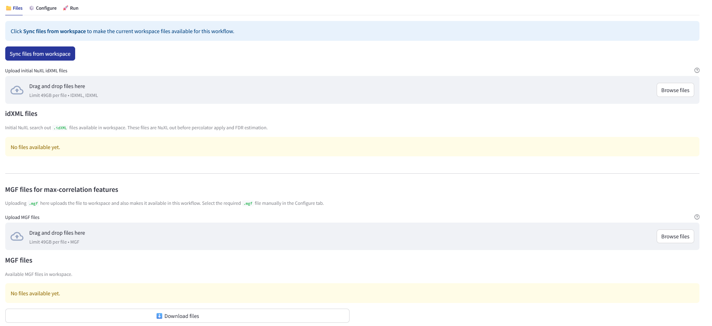
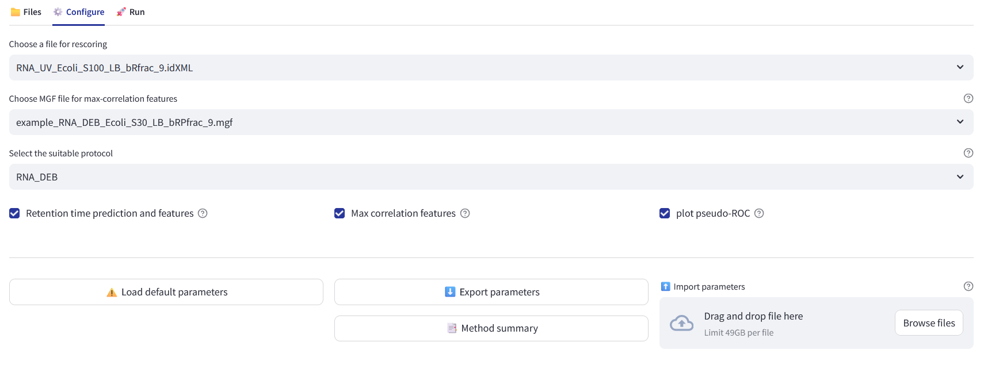

# NuXL Rescoring Workflow — User Tutorial

## Purpose

The **NuXL Rescoring Workflow** improves NuXL cross-link identifications by using data-driven features such as retention-time prediction and fragment-ion intensity features. It is typically run after the NuXL search workflow.

Use this workflow when you want to rescore NuXL results and generate RDDF rescored cross-link identifications for downstream analysis, for example DIA spectral library generation or to check the improved identifications rate.


---

## Files



You need one **initial NuXL idXML file**.

This should be the original NuXL search result before Percolator/FDR filtering.

Do **not** use already filtered or rescored files, such as files containing:

```text
_0.0100
_0.1000
_1.0000
_perc
RDDF_
```

Examples of files that should not be used as rescoring input:

```text
sample_perc_0.0100_XLs.idXML
sample_perc_1.0000_XLs.idXML
RDDF_sample_perc_0.0100_XLs.idXML
```

You can either upload an initial NuXL idXML file directly or sync already available files from the workspace (if you already analyze the sample with NuXL search engine in same workspace, should available here).

After upload or sync, the available idXML files are shown in the file table.

If your file is rejected, check that it is the original NuXL idXML output and not a Percolator/FDR or RDDF file (please check the above constraints).

## Optional input

An **MGF file** is needed when **Max correlation features** are enabled.

If you use only retention-time features, an MGF file is not required.

you could upload the mgf file and view the MGF files on the page, which should be available for selection in configure step. 

---

## Configure



## Choose a file for rescoring

This option selects the NuXL `.idXML` file that will be rescored.

Example:

```text
RNA_UV_Ecoli_S100_LB_bRfrac_9.idXML
```

---

## Choose MGF file for max-correlation features

This option selects the `.mgf` file used for max-correlation based rescoring features.

The MGF file is required when **Max correlation features** is enabled.

The MGF file should correspond to the same experiment/sample as the selected idXML file. If the wrong MGF file is selected, the rescoring may fail or produce unreliable feature values.

Example:

```text
example_RNA_DEB_Ecoli_S30_LB_bRfrac_9.mgf
```

If **Max correlation features** is disabled, this file is not used.

---

## Select the suitable protocol

This option defines the experimental cross-linking protocol used for the sample.

Available options:

```text
RNA_DEB
RNA_NM
RNA_4SU
RNA_UV
RNA_Other
```

The selected protocol determines which retention-time model and calibration settings are used during rescoring.

Choose the option that matches the NuXL experiment.

Examples:

```text
RNA_UV     → use for UV cross-linking experiments
RNA_DEB    → use for DEB cross-linking experiments
RNA_NM     → use for NM cross-linking experiments
RNA_4SU    → use for 4SU experiments
RNA_Other  → use when the experiment does not match the predefined protocols
```

---

## Retention time prediction and features

This checkbox enables retention-time based rescoring features.


Recommended setting:

```text
Enabled
```

Disable this only if you want to run rescoring without retention-time information.

---

## Max correlation features

This checkbox enables fragment-ion intensity or max-correlation based features.

When enabled, the workflow uses the selected MGF file to calculate spectral feature information for rescoring.

Recommended setting:

```text
Enabled
```

Important:

```text
If this option is enabled, an MGF file must be selected.
```

---

## plot pseudo-ROC

This checkbox enables generation of a pseudo-ROC comparison plot.

The plot is used to compare identification behavior before and after rescoring. It is useful for visually checking whether rescoring improves the result.

Recommended setting:

```text
Enabled
```

If the required reference files are not available, the workflow may skip the pseudo-ROC plot. This does not necessarily mean the rescoring failed. If you already run the Nuxl search engine on same rescore file and workspace, it should generate plot.

---

## Load default parameters

This button resets the configure tab to the default workflow settings.

Use this if parameters were changed and you want to return to the recommended default setup.

Typical defaults:

```text
Retention time prediction and features: enabled
Max correlation features: enabled
plot pseudo-ROC: enabled
```

---

## Export parameters

This button downloads the currently selected workflow parameters.

Use this if you want to save the analysis settings or reuse them later.

---

## Import parameters

This allows you to upload a previously exported parameter file.

Use this when you want to repeat an analysis with the same settings.

---

## Method summary

This button generates a text summary of the workflow method and selected parameters.

Use this for documentation, reporting, or manuscript method descriptions.

---

## Recommended configuration

For most analyses, use:

```text
idXML file: initial NuXL idXML file
MGF file: matching MGF file
Protocol: matching experimental protocol
Retention time prediction and features: enabled
Max correlation features: enabled
plot pseudo-ROC: enabled
```

This runs the full rescoring workflow using both retention-time and spectrmax correlation correlation features.

| Feature                         | Description                                                                                                 |
| ------------------------------- | ----------------------------------------------------------------------------------------------------------- |
| `rt_diff`                       | Absolute difference between the observed and predicted retention time.                                      |
| `rt_diff_best`                  | Best retention time difference, selected as the minimum `rt_diff` for the same peptidoform.                 |
| `observed_retention_time_best`  | Best observed retention time, selected from the entry with the minimum `rt_diff` for the same peptidoform.  |
| `predicted_retention_time_best` | Best predicted retention time, selected from the entry with the minimum `rt_diff` for the same peptidoform. |
| `max_corr_feature (b_y_corr)`                      | Maximum Pearson correlation calculated between predicted and target intensities of b- and y-ions (for first 3-prefix/suffix ions).           |

These features should be annotated in the `idXML` file and used for rescoring in combination with additional features generated by the NuXL search engine.


